## Nails studio app

La app se basa en un estudio ficticio donde las clientas puedan registrarse y pedir citas con los diferentes servicios que ofrece el salón.

### Objetivo

El objetivo principal de la aplicación es conseguir que los usuarios puedan agendar sus citas y escoger el servicio que desean.

### Temática

En este proyecto se proponen diferentes servicios de manicura que los usuarios pueden escoger y agendar, revisar y modificar a su gusto.

Elegí un estudio de uñas porque es un pequeño hobbie al que me dedico en mi tiempo libre desde hace 2 años.

### Tecnologías y herramientas

- **TypeScript** 🔵
- **Express JS** 🚀
- **MySQL** 🐬
- **Node.js** 🛠️
- **JavaScript** 💻
- **JWT (JSON Web Tokens)** 🔑

### Base de Datos en MySQL

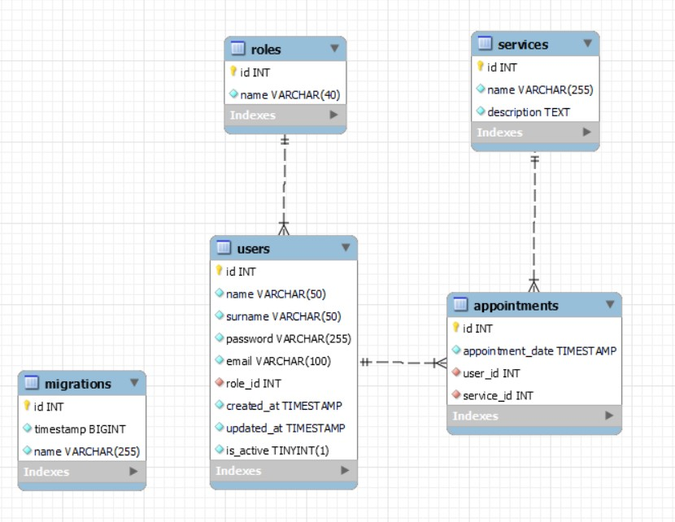

### Instalación local

1. Clonar el repositorio:
```
$ git clone https://github.com/marinaescriva/nails_studio.git
```

2. Instalar dependencias 
```
$ npm install --y
```

3. Iniciar Express en el servidor
```
$ npm run dev
```

4. Ejecutar las migraciones
```
$ npm run run-migrations
```

### Rutas

Las rutas trabajadas para el proyecto son:

</br>
</br>

**Autentificacion (AUTH)**

<details>
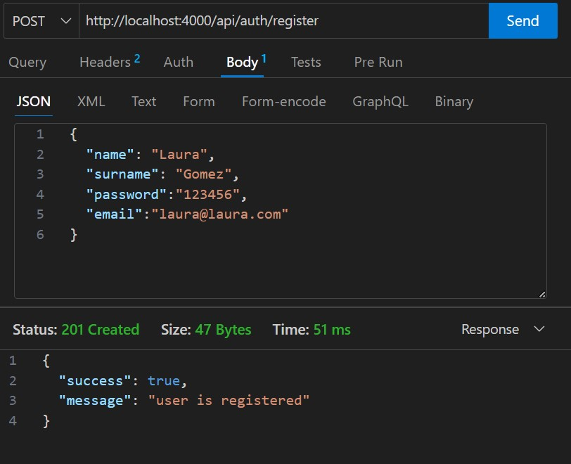
    <summary>Primero registramos un usuario.  </summary>
    (Los parámetros obligatorios serían el email y el password)


</details>

<details>
 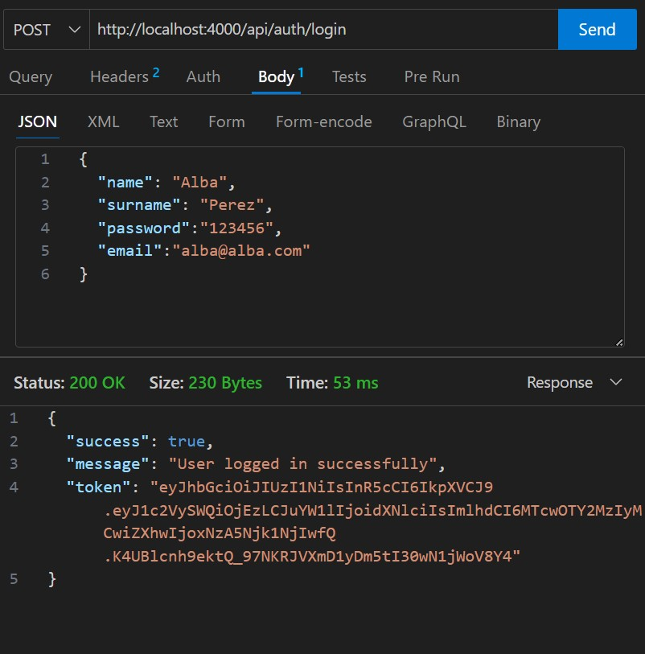
    <summary>Realizar el login  </summary>
    Tras el registro del usuario, podemos realizar el login de un usuario previamente creado utilizando su email y contraseña.

    Al logearse el usuario obtiene un token, donde se registran todos sus datos.
</details>

</br>
</br>

**Usuarios (Users)**

Las rutas de usuarios incluyen:

<details>

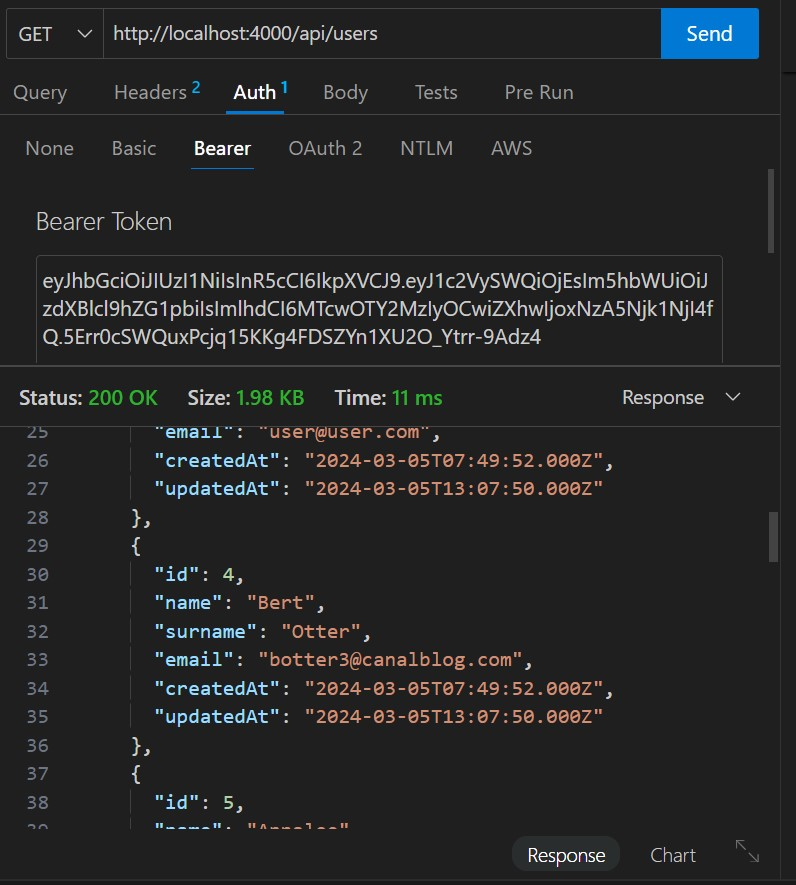 
  <summary>Obtener todos los usuarios del sistema siendo Super_admin </summary>

</details>

<details>
 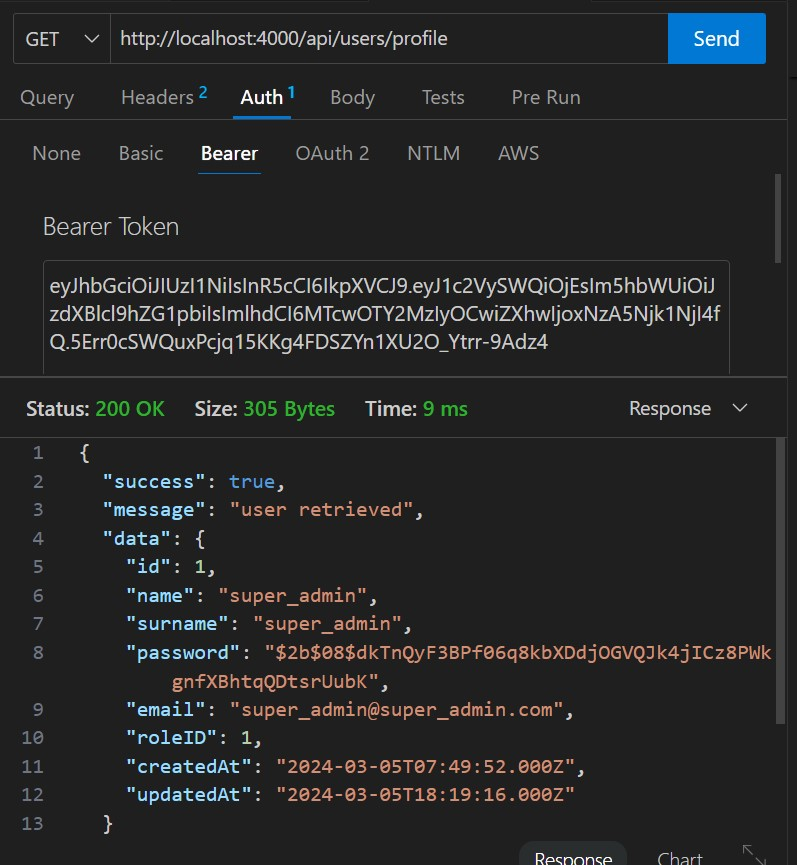 
  <summary>Ver el perfil del usuario</summary>
</details>

<details>
    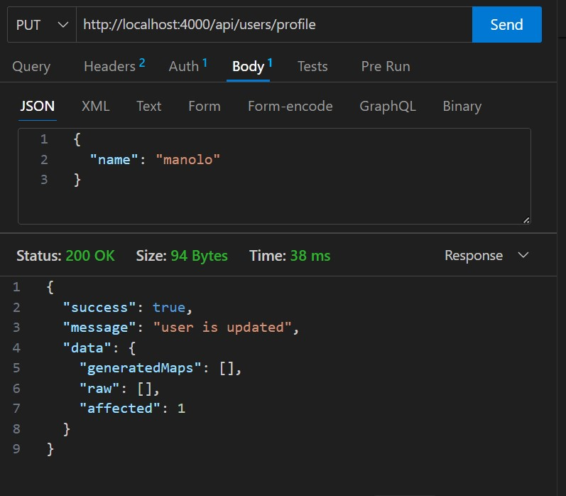 
    <summary>Editar el nombre del usuario</summary>
</details>
</br>
</br>

**Servicios (Services)**

Las rutas de servicios incluyen:

<details>
    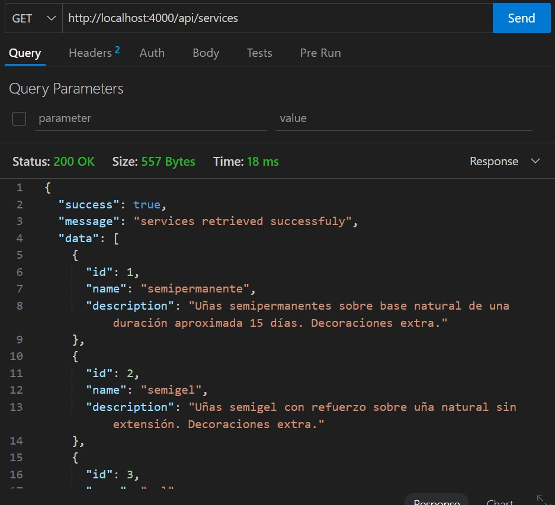 
    <summary>Ver todos los servicios </summary>
</details>

</br>
</br>

**Citas (Appointments)**

Las rutas de citas incluyen:

<details>
    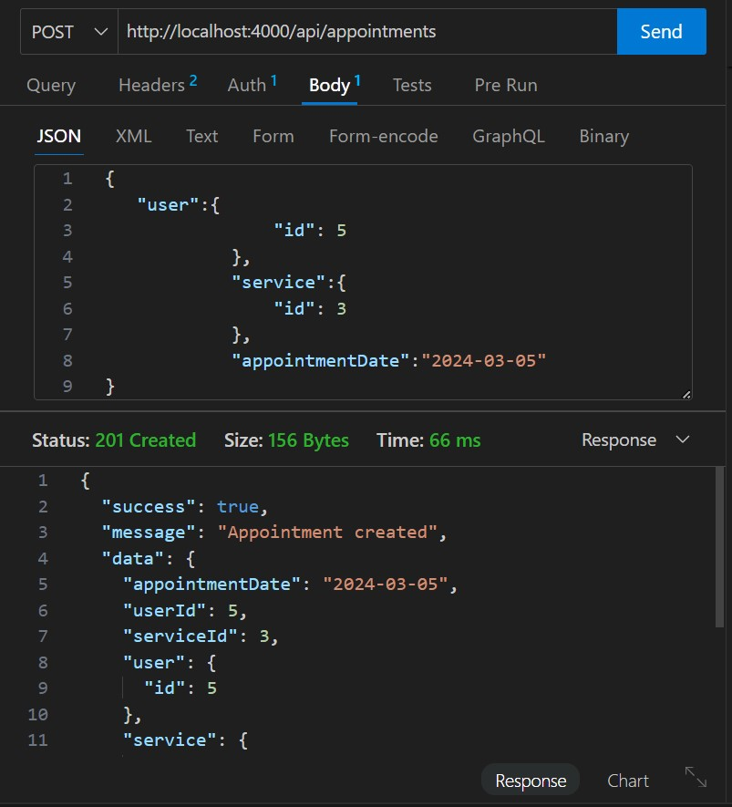 
    <summary>Crear una nueva cita </summary>
</details>

<details>
    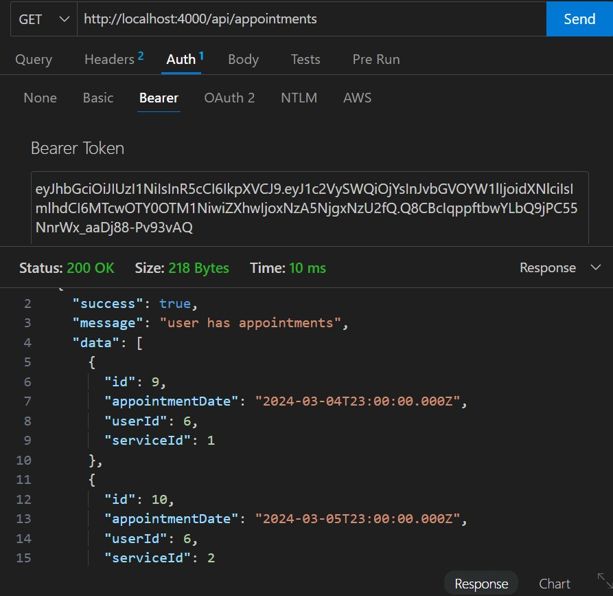 
    <summary>Ver tus citas </summary>
</details>
<details>
    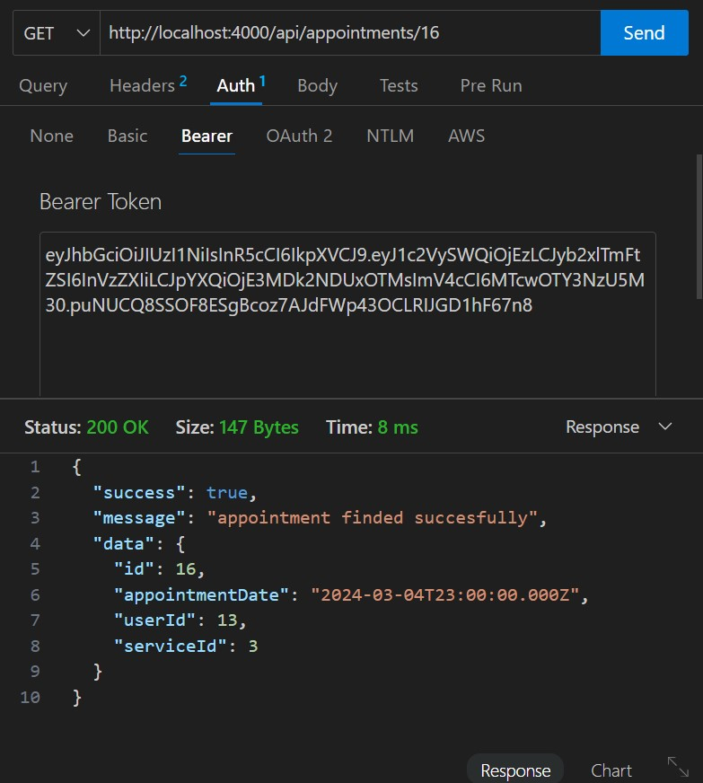 
    <summary>Ver la cita por id </summary>
</details>
<details>
    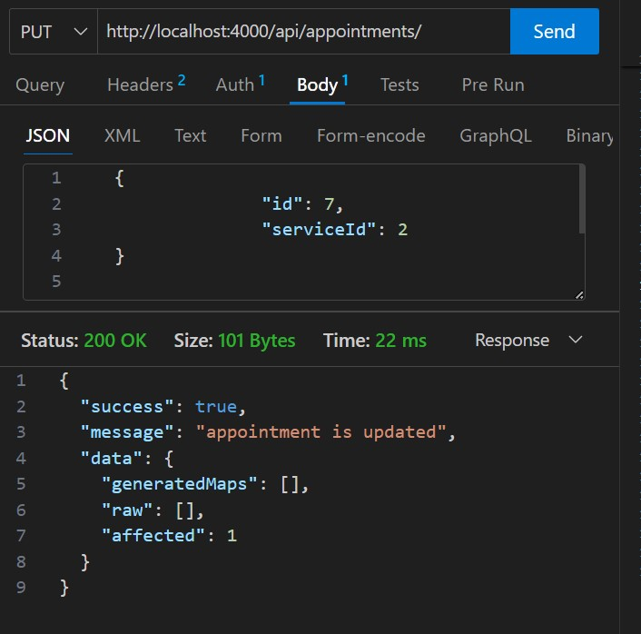 
    <summary>Editar una cita cambiando el servicio </summary>
</details>

### Agradecimientos

A mis compañeros por su ayuda y consejo, pero sobretodo por su paciencia:

*Marta* https://github.com/MartaGBayona
*Fernando* https://github.com/Ferelbue
*Carlos* https://github.com/CariblaGIT
*Pedro* https://github.com/Eryhnar
*Ana* https://github.com/ariusvi


